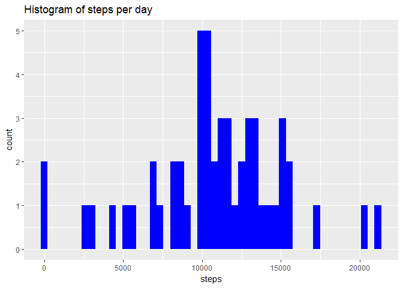

# Reproducible Research: Peer Assessment 1


## Loading and preprocessing the data

Load the libraries, data and view the structure of data set, convert "date" to date

```r
library(dplyr)
library(ggplot2)
library(scales)
setwd("C:/Users/Silja/Documents/~too/Rdatascience/course5/week2/RepData_PeerAssessment1")

data<-read.csv("activity.csv")
data$date<-as.Date(as.character(data$date),format="%Y-%m-%d")
data$interval<-with(data,ifelse(nchar(interval)==1,paste0("00:0",interval),
                       ifelse(nchar(interval)==2,paste0("00:",interval),
                              ifelse(nchar(interval)==3,paste0("0",substr(interval,1,1),":",substr(interval,2,3)),
                                   paste0(substr(interval,1,2),":",substr(interval,3,4))))))
```


## What is mean total number of steps taken per day?  

Histogram of the total number of steps taken each day:


```r
daily<-data%>%
  group_by(date)%>%
  summarize(steps=sum(steps))

ggplot(daily,aes(steps))+geom_histogram(fill="blue",bins=50)+
  ggtitle("Histogram of steps per day")
```

```
## Warning: Removed 8 rows containing non-finite values (stat_bin).
```

<!-- -->

```r
mean<-round(mean(daily$steps,na.rm=T),1)
median<-round(median(daily$steps,na.rm=T),2)
```

**Mean number** of steps per day is 1.07662\times 10^{4} and **median** of number of steps per day is 1.0765\times 10^{4}.  


## What is the average daily activity pattern?


```r
aggr<-data%>%
  filter(!is.na(steps))%>%
  group_by(interval)%>%
  summarize(mean_steps=mean(steps))
aggr$interval=strptime(aggr$interval, format='%H:%M')

ggplot(aggr,aes(interval,mean_steps))+geom_line(color="blue")+
  ggtitle("Average number of steps taken by intervals")+
  ylab("Average number of steps")+
  scale_x_datetime(labels=date_format("%H:%M"))
```

<!-- -->

```r
x<-unlist(aggr[aggr$mean_steps==max(aggr$mean_steps,na.rm=T),1])
max_interval<-paste0(x[3],":",x[2])
```


Interval **8:35** contains the maximum number of steps


## Imputing missing values

Check NA values  


```r
na_steps<-round(mean(is.na(data$steps))*100,1)
```

**13.1** % of values for steps are missing. 

Impute missing valus with mean of the day, if all values for the date are missing, then mean of interval


```r
data_imp<-data%>%
  group_by(date)%>%
  mutate(steps=ifelse(!is.na(steps),steps,mean(steps,na.rm=T)))%>%
  group_by(interval)%>%
  mutate(steps=ifelse(!is.na(steps),steps,mean(steps,na.rm=T)))
```

Histogram of the total number of steps taken each day (with imputed data:


```r
daily_imp<-data_imp%>%
  group_by(date)%>%
  summarize(steps=sum(steps))

ggplot(daily_imp,aes(steps))+geom_histogram(fill="blue",bins=50)+
  ggtitle("Histogram of steps per day")
```

<!-- -->

```r
mean_imp<-round(mean(daily_imp$steps),1)
median_imp<-round(median(daily_imp$steps),1)
```

New **Mean number** of steps per day is 1.07662\times 10^{4} and new **median** of number of steps per day is 1.07662\times 10^{4}. 

The difference for mean between non-imputed and imputed data is 0 and the difference for median is 1.2

## Are there differences in activity patterns between weekdays and weekends?


```r
#create weekday
data_imp$weekday<-format(as.Date(data_imp$date),"%w") 
data_imp$weekend<-as.factor(ifelse(data_imp$weekday %in% c(0,6),"weekend","weekday"))

aggr_imp<-data_imp%>%
  group_by(interval,weekend)%>%
  summarize(mean_steps=mean(steps))%>%ungroup
aggr_imp$interval=strptime(aggr_imp$interval, format='%H:%M')

ggplot(aggr_imp,aes(interval,mean_steps))+geom_line(color="blue")+
  facet_grid(weekend~.)+
  ggtitle("Average number of steps taken by intervals")+
  ylab("Average number of steps")+
  scale_x_datetime(labels=date_format("%H:%M"))
```

<!-- -->
